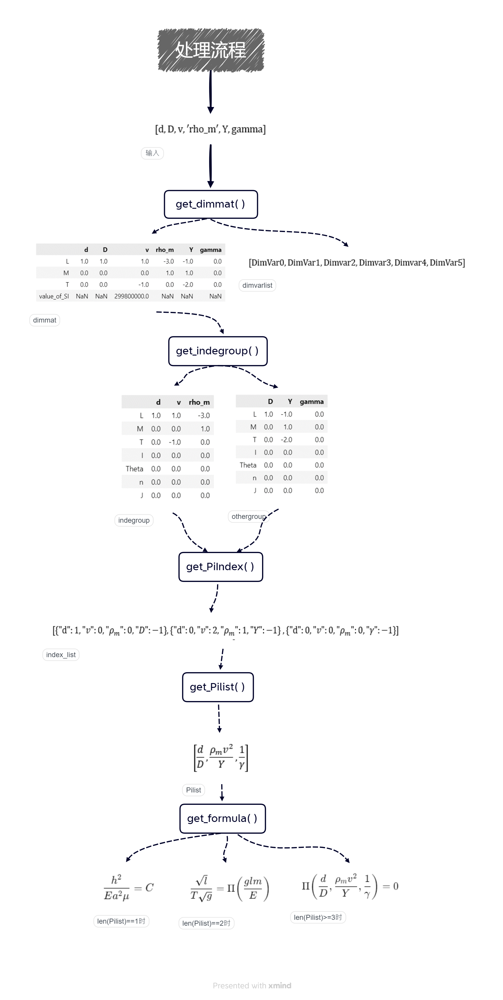
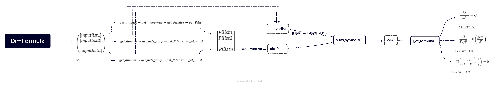

# Dimanaly:Dimensional Analysis-一个用于量纲分析的模块
## 介绍
&emsp;&emsp;物理规律不因势的规范选取而改变由此引出规范不变性,物理规律不因惯性参考系的选取而改变由此引出相对性原理……物理规律不因测量单位的选择而改变由此引出无纲量,量纲分析与$\Pi$定理
&emsp;&emsp;量纲分析有较强的实用性,很多文献与参考书上都有总结量纲分析的步骤,量纲分析的处理流程也相对固定,因此完全可以实现量纲分析流程的自动化。
## 基本功能演示

## 文件
1. Dimanaly.py:主文件
2. data_base.xlsx:数据库文件
3. tutorial.ipynb:对程序的功能进行了一些简单介绍
4. demonstration.ipynb:对程序的一些示范与应用
5. The_Energy_of_an_Atomic_Bomb_Explosion.ipynb:使用程序估计了第一颗原子弹爆炸释放的能量
6. docs:功能演示的GIF文件、处理流程的基本单元图片文件、主类Dimformula的工作流程图片文件
## 处理流程单元

## 主类Dimformula的工作流程
*详见doc文件夹中的Dimformula_flow.png文件*

## 说明与改进
* **关于数据库**
<br>&emsp;&emsp;为方便获取物理量的量纲信息,此程序使用了一个excel文件,当然用户可以根据自己的需求在原程序的基础上稍加修改使用csv文件或SQL数据库等.
<br>&emsp;&emsp;它的好处在于用户可以根据自己的需求与偏好设置所需物理量的符号、量纲、数值,但坏处是对于没有相关数据资源的用户,他们就难以体验到使用数据库信息所带来的便捷,虽然data_base.xlsx文件中也提供了一些数据信息,但并不全面.
&emsp;&emsp;为弥补这方面的短板,之后会考虑使用scipy.constants.physical_constants的功能以健全数据信息的查找功能
* **关于公式正确性的检查**
&emsp;&emsp;本模块只能检查用乘幂组合在一起的等式,且需要将所涉及的量手动移动到等式的一边,然后传入由符号与幂指数所组成的字典.
&emsp;&emsp;最好的实现方式应当可以对LaTeX公式、sympy符号表达式等进行处理,sympy符号表达式可以转化为LaTeX公式,因此归根结底是能够实现对LaTeX公式进行处理,但LaTeX数学公式所涉及到的符号多种多样,而且可以出现在任意位置,所以对LaTeX公式的解析是一件非常繁琐的事.实现起来相当困难
* **构造的无纲量并不唯一**
&emsp;&emsp;对于主类DimFormula,它的主要方法get_formula()输出的结果总是倾向于把传入DimFormula的列表中靠前的物理量作为基底并放在无纲量的分子上,而靠后的物理量倾向于被放在无纲量的分母上,因此所构造的无纲量总是倾向于以靠前的物理量为基底进行构造,为构造出理想的无关量,可以人为地改变传入的物理量顺序,或将物理量打包再传入,在demonstration.ipynb文件中的"单摆的周期"、"管道流动的传热"案例中有相关示范
* **关于单位制的选取**
&emsp;&emsp;本模块的核心部分并不依赖于单位制的选取,使用国际单位制,高斯单位制等都不影响最后输出的结果,只不过若要改变单位制,数据库就要做出相应的改动,而与数据库相关的程序也需要作出相应的改动,为方便这方面的改动,之后会考虑进行相应的修改
## 来自AI的一些协助
*因为误删了查询记录,因此所述协助并不完整*
1. 清除掉pandas模块内的dataframe中全为零的行:`dataframe=dataframe\[~(dataframe==0).all(axis=1)]`
2. 找到最简阶梯矩阵中每行第一个不为零元素所对应的列索引:`numpy.argmax(mat_U!=0,axis=1)`
3. 创建关于未知数目的多个自变量函数:`sympy.Function('\Pi')(*Pilist)`
4. 使用QR分解的方式寻找极大线性无关组
## 使用到的函数、方法或功能
```python
1. func(*args,**kwrds)
2. isinstance()
3. list()
4. set()
5. zip()
6. dict.keys()
7. dict[]
8.{**dic1,**dic2}
9. numpy.where()
10. numpy.transpose()
11. numpy.linalg.qr()
12. numpy.linalg.matrix_rank()
13. numpy.linalg.solve()
14. numpy.concatenate()
15. numpy.shape()
16. numpy.average()
17. numpy.abs()
18. numpy.argmax()
19. numpy.astype()
20. pandas.read_excel()
21. pandas.concat()
22. pandas.Series()
23. pandas.series[]
24. pandas.series.sum()
25. pandas.series.index
26. pandas.series.astype()
27. pandas.series.str.contains()
28. pandas.dataframe[]
29. pandad.dataframe.all()
30. pandas.dataframe.index
31. pandas.dataframe.reindex()
32. pandas.dataframe.columns
33. pandas.dataframe.columns.duplicated()
34. pandas.dataframe.loc[]
35. pandas.dataframe.iloc[]
36. pandas.dataframe.drop()
37. pandas.dataframe.dropna()
38. pandas.dataframe.fillna()
39. pandas.dataframe.astype()
40. sympy.Symbol()
41. sympy.S()
42. sympy.simplify()
43. sympy.subs()
44. sympy.nsimplify()
45. sympy.Function()
46. sympy.Eq()
47. sympy.function()
48. sympy.solve()
49. sympy.atoms()
50. sympy.evalf()
51. re.sample()
```
